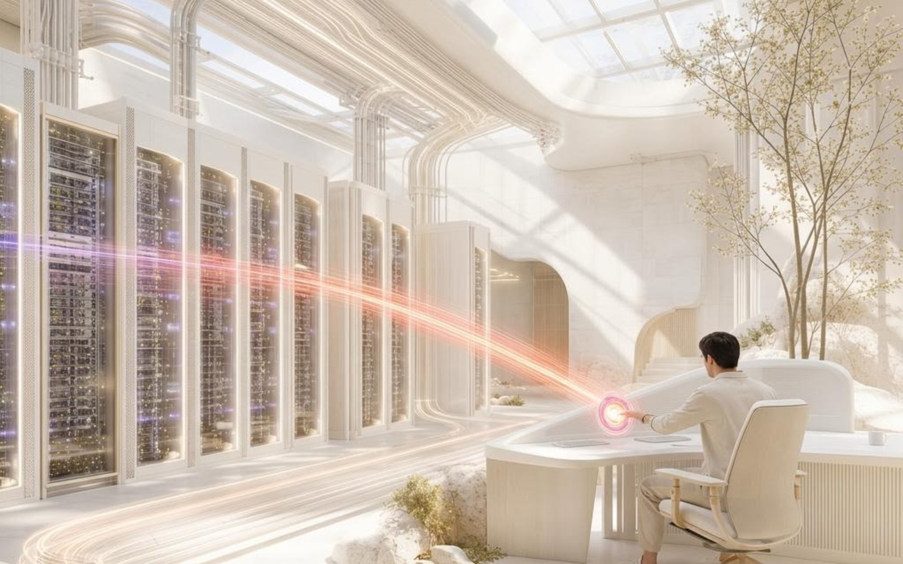

# Cognirise case-study image design guide

**Guide version:** 1.0.0  
**Status:** Required reference for new case-study artwork  
**Scope:** Public case-study imagery in `artifacts/cognirise-website/public/images/cognirise/cases/cinematic/`  
**Evidence checked:** `scripts/cms/output/case-cinematic-delivery-report.json` (`schemaVersion: 1`, `verifiedAt: 2026-09-11T12:56:59.422Z`), `scripts/src/cms/case-studies.ts`, and the checked-in rasters  
**Reference style memory:** `.agents/memory/cognirise-pulse-direction.md`, `.agents/memory/pulse-artwork-text-hygiene.md`, and `deliverables/cognirise-five-industry-images/DESIGN-DIRECTION.md`

Read this guide before creating, selecting, editing, or exporting a case-study image. It describes the current approved cinematic family; it does not authorize replacing an approved asset or imply that a generated image is a reconstruction of a client system. The examples below are existing repository assets. **Do not generate new images as part of documenting or reviewing this guide.**

## 1. What this guide protects

The case-study rail uses original, text-free editorial scenes to make an operating story tangible. It is not a gallery of screenshots, a product UI montage, or a literal illustration of a business noun. The visual should communicate a physical relationship at a glance: material enters, is reviewed or governed, and reaches a useful destination.

The shared Cognirise Pulse language is:

- a warm-white, ivory, or pale-neutral architectural world;
- credible, photoreal materials and plausible geometry;
- deep navy structure used with restraint;
- a small number of violet–magenta–coral signal paths that express movement, exchange, or a controlled gate;
- soft dawn or late-afternoon light, with warm highlights and controlled shadows;
- editorial asymmetry and a clear spatial read at full size and at a narrow card size; and
- human scale where a person makes the review, handoff, or approval legible.

The intended result is calm, substantial, and specific. “Premium AI”, “digital transformation”, or “portfolio optimization” are not scene descriptions. Translate the mandate into a place, a material process, a human action, a route, and a destination before writing a prompt.

## 2. Versioning, evidence, and what is not known

### 2.1 Current evidence

The delivery report records **21** exact immutable pins and durable readbacks. All 21 checked-in cinematic files are JPEG rasters at **1600 × 1000 px** (an **8:5** aspect ratio). `file` identifies them as JFIF JPEGs with three components. The delivery report records the public path, byte size, SHA-256, CMS asset ID, media-version ID, revision ID, and revision number for each asset.

The source lineage in `scripts/src/cms/case-studies.ts` is:

- source presentation: `attached_assets/Cognirise-Case-Studies-Azure-Deployments_-_Read-Only_1788946106330.pptx`;
- source date recorded by the seed: `2026-09-06`;
- public source label: `Approved source presentation, slide 01` through `Approved source presentation, slide 21`; and
- public artwork treatment: an original commissioned editorial scene, with no client interface or source-system data.

The image files were introduced with the approved case-study consolidation in repository commit `1f5e6d9`. A commit is a repository lineage clue, not a generative provenance record.

### 2.2 Do not invent generative provenance

The repository records no model/provider, model version, seed, sampler, step count, CFG or guidance value, denoise strength, LoRA, reference-image conditioning strength, or original generation prompt for these 21 rasters. Those fields are **not known** for the current approved set. Do not reverse-engineer or guess them from pixels, and do not write an invented value into a receipt. For a historical asset, record `not recorded in repository evidence`; for a new asset, make the field mandatory and capture it at generation time.

The prompt blocks in this guide are reusable **new-work direction**, not recovered prompts for the examples. They intentionally specify physical scenes rather than claiming to reproduce any previous generation.

## 3. Verified reference gallery

The following examples were opened at their checked-in native raster and represent six sectors. Their captions describe what the image visibly communicates; they are not claims about a client or a real facility.

### Manufacturing & Industrial


**Verified reference:** `../artifacts/cognirise-website/public/images/cognirise/cases/cinematic/01-industrial-knowledge.jpg`  
**CMS title:** Making industrial knowledge self-service · **source:** slide 01 · **dimensions:** 1600 × 1000 · **bytes:** 290,630 · **SHA-256:** `b961284318d5c2b737465d195b0ed366e4ec229daa7346a0624362c67f1fc36f`  
**Observed lesson:** warm factory architecture, two anonymous process workers, stacked translucent material, and one long violet/pink/coral route establish a source, human review, and operating line. The route is the visual metaphor; no labels are needed.

### Life Sciences


**Verified reference:** `../artifacts/cognirise-website/public/images/cognirise/cases/cinematic/02-pharmacy-signals.jpg`  
**CMS title:** Connecting pharmacy operations signals · **source:** slide 02 · **dimensions:** 1600 × 1000 · **bytes:** 282,570 · **SHA-256:** `e17d02ba685fb8f6fc93db8fe817dfe236c1d5a8f145b6cbdcc6a81732f5fdb8`  
**Observed lesson:** refrigerated storage, trays, glass, and a single specialist give the scene a credible operating context. Several related routes converge on a physical control point, but they remain legible rather than becoming a neon network.

### Retail & Consumer


**Verified reference:** `../artifacts/cognirise-website/public/images/cognirise/cases/cinematic/04-specialist-retail.jpg`  
**CMS title:** Taking a specialist retailer online · **source:** slide 04 · **dimensions:** 1600 × 1000 · **bytes:** 224,337 · **SHA-256:** `887683263a4418769592cfc8113776ac4c3a6714c1886951f36cd4e62d0b83c6`  
**Observed lesson:** the foreground product check and background handoff read as one journey. Ivory stone, glass, flowers, and a few lilac routes provide warmth and tactility. Product containers are unbranded and must remain free of readable labels.

### Travel & Hospitality


**Verified reference:** `../artifacts/cognirise-website/public/images/cognirise/cases/cinematic/16-hotel-asset-reuse.jpg`  
**CMS title:** Finding a second life for hotel assets · **source:** slide 16 · **dimensions:** 1600 × 1000 · **bytes:** 281,133 · **SHA-256:** `06b145c7abfaa4cf03161dee3e4c9c900acea3607c7aa36fa1d73626fb665f26`  
**Observed lesson:** human handoff, linens, the cart, plants, and an open architectural threshold communicate a material route without requiring a glowing line. This is a useful reminder that flow can be carried by staging and gaze; never add a light path merely to decorate a quiet scene.

### Public Sector


**Verified reference:** `../artifacts/cognirise-website/public/images/cognirise/cases/cinematic/13-public-services.jpg`  
**CMS title:** Prototyping agentic public services · **source:** slide 13 · **dimensions:** 1600 × 1000 · **bytes:** 275,336 · **SHA-256:** `b16cd546120146aabcdfd4cfdab6bf8b1113704936b450e6165dd55c40df665a`  
**Observed lesson:** a physical civic model provides sector specificity without a literal dashboard. Violet and coral routes pause at a human raised-hand decision point. The map must stay abstract and must not contain place names, flags, coordinates, or agency marks.

### Telecoms



**Verified reference:** `../artifacts/cognirise-website/public/images/cognirise/cases/cinematic/15-data-centre-incidents.jpg`  
**CMS title:** Orchestrating data-centre incidents · **source:** slide 15 · **dimensions:** 1600 × 1000 · **bytes:** 317,337 · **SHA-256:** `ab7e4b75d54416fc41018aa5474058336b4a08f85b6d333ff17c147c27a9d371`  
**Observed lesson:** server racks, overhead services, skylight, and one seated operator establish infrastructure scale. The alert route is conspicuous but not allowed to overwhelm the white architecture. It is a physical signal, not a floating status panel.

These six are style references, not mandatory compositions. A new image must solve its case-specific story while retaining the invariant rules below.

## 4. Invariant rules

These rules do not change from sector to sector:

1. **Native frame:** compose for a horizontal 8:5 frame at 1600 × 1000 or larger at the same ratio. Preserve the complete image and its proportions in the card.
2. **Light-neutral world:** warm white, ivory, pale stone, satin concrete, light wood, clear or lightly tinted glass, and small natural elements dominate the frame.
3. **Cinematic realism:** plausible scale, gravity, reflections, material joins, hands, tools, and architectural construction. Use a photographic or physically based raster look, never a vector illustration or flat infographic.
4. **Warm controlled light:** dawn or late-afternoon light, broad soft highlights, long but believable shadows, and enough tonal separation to read at card size.
5. **One readable physical story:** a source or entry, a spatial anchor or control point, and a destination. The viewer should understand the relationship before reading the case title.
6. **Restrained Pulse flow:** use zero to three purposeful paths or luminous gates. They should be physically integrated into floors, channels, apertures, bridges, storage, or gateways. They are directional energy, not decorative neon.
7. **Human scale, not portraiture:** use anonymous people only when their action clarifies review, handoff, approval, or operation. Do not make a face the product.
8. **No generated text:** no letters, numbers, words, logos, watermarks, captions, signage, flags, insignia, UI labels, realistic-looking fake labels, or pseudo-typographic marks inside the raster.
9. **Public-safe abstraction:** no client name, identifiable site, real source document, real interface, account data, location-specific landmark, or unsupported claim of production deployment.
10. **Quiet edges:** preserve clean edges and a low-detail safe region for responsive presentation. Never clip the focal object, person, hand, gate, route endpoint, or material destination.

## 5. Pulse palette and density specification

The following digital swatches are the verified Cognirise web signal tokens found in the current Industries implementation. They are a color-direction reference for generated light and post-production, not a claim that every source pixel has been sampled from these files.

| Role | Hex | Use |
| --- | --- | --- |
| Warm white / paper | `#fdfcfb` | dominant ground and architectural light |
| Deep navy / ink | `#102957` | structure, shadow anchors, fine high-contrast details |
| Midnight navy | `#071936` | only occasional deep recesses or reflective structures |
| Soft neutral | `#f1f3f7` | cool-neutral balance in glass, concrete, or haze |
| Neutral line | `#cbd3e1` | quiet seams, rails, and low-contrast divisions |
| Pulse violet | `#7659df` | primary directional route or gate glow |
| Pulse pink / magenta | `#db509e` | secondary route blend and moments of convergence |
| Pulse coral | `#ff775d` | endpoint, exception, decision, or warm signal accent |

Warm orange can appear as a restrained light transition between magenta and coral, but no separate canonical orange token is recorded in the source evidence. Select it only when it helps a warm reflection or endpoint, record the chosen value in the generation receipt, and keep it less prominent than coral.

Use these proportions as a review target:

- **88–94%** warm-neutral architecture, air, material, or natural background;
- **4–8%** navy or dark reflective structure;
- **2–6%** total luminous Pulse route, gate, or endpoint; and
- within the luminous area, roughly **45–65% violet**, **20–35% magenta**, **10–20% coral**, with warm orange optional and subordinate.

These are composition targets, not pixel-count requirements. Reduce the light before reducing the architecture. A route that reads as a blanket of purple fails the restrained-palette rule even if every individual color is technically on-brand.

## 6. Composition, camera, and safe areas

### 6.1 Camera language

Use a natural architectural wide-angle perspective equivalent to approximately **28–35 mm full-frame**, at eye level, a low human-height viewpoint, or a modest elevated three-quarter view. This is direction for a new brief, not a recovered camera setting for an existing image. Avoid fisheye distortion, extreme wide-angle convergence, forced bird's-eye abstraction, and shallow depth of field that removes the process anchor.

The image should have:

- a foreground entry or material cue;
- a middle-ground human, gate, console, bridge, counter, storage bay, or other spatial anchor;
- a luminous or visually quiet destination; and
- converging architectural lines that establish depth without turning the scene into a tunnel.

Prefer one decisive focal hierarchy over a collage of equal objects. A slight asymmetry is welcome: place the primary anchor around one third or two thirds of the width, then let a route or architectural line carry the eye through the remaining space.

### 6.2 Safe areas

At the native 1600 × 1000 frame, keep critical content inside an **8% inset**: x = 128–1472 px and y = 80–920 px. Faces, hands, control points, route endpoints, key materials, and the destination must remain inside this region. Keep the outer band quiet enough to tolerate a responsive browser edge, focus treatment, or a deliberate editorial crop.

If a layout places a text block over the image, reserve at least **25% of the frame** as low-detail negative space on the agreed side. Do not render the text into the image. Confirm the intended text side before generation; otherwise keep both side margins calm and place the visual anchor centrally enough to survive either editorial arrangement.

At the compact card targets, the same rule scales to:

- 400 × 250 CSS px: at least 32 px horizontal and 20 px vertical quiet inset;
- 425 × 266 CSS px (rounded from 265.625): at least 34 px horizontal and 21 px vertical quiet inset; and
- 320 × 200 CSS px: at least 26 px horizontal and 16 px vertical quiet inset.

The whole source is 8:5. Do not use a generic `cover` crop that removes the source or destination to make an arbitrary rectangle. If a different crop is genuinely needed, commission and receipt a separate intentional derivative rather than silently cropping the approved master.

## 7. Humans, architecture, materials, and visual density

### Humans

- Use zero to three people, with one or two usually enough.
- Show a concrete action: checking, carrying, routing, pausing, confirming, opening, handing over, or observing.
- Favor natural posture, believable hands, correct contact with objects, and varied but non-identifying appearance.
- Use ordinary role-appropriate clothing in ivory, sand, navy, grey, or muted neutral tones. Avoid uniforms, badges, lanyards, medical insignia, military dress, and branded workwear.
- Keep people anonymous and secondary to the spatial story. No readable faces, employee IDs, customer records, or implied endorsement.

### Architecture and materials

Begin with real physical relationships: stone or satin concrete floor, warm timber, brushed metal, frosted or clear glass, controlled water, textile, shelving, bridge, gate, archive, server rack, production line, civic model, or service cart. Add deep navy only where a recess or structural plane needs weight. Add vegetation sparingly to keep the scene alive without turning it into a lifestyle stock photo.

Materials need plausible edges and scale. Glass should reflect the room, metal should carry a believable highlight, textiles should drape, water should have a surface, and translucent light should interact with the surrounding material rather than sit as a sticker.

### Density

Compose one main story, one supporting physical detail, and one route or decision cue. Background detail should support sector recognition without competing with the anchor. As a practical check, approximately one third of the frame should remain visually quiet enough that the card retains a clear silhouette and any surrounding HTML copy remains dominant. Avoid repeating the same gate, screen, person, or light strip across a frame.

## 8. Invariant versus variable

| Keep invariant | Vary by case |
| --- | --- |
| 8:5 horizontal composition and complete-frame delivery | sector setting and physical process |
| warm light-neutral architectural world | source material: archive, tray, dossier, model, rack, product, or textile |
| realistic scale, materials, perspective, and contact | route geometry: line, channel, bridge, aperture, gateway, or staged handoff |
| restrained violet–magenta–coral energy | whether a human reviews, pauses, carries, or approves |
| zero-to-three purposeful paths; no spectacle | one to three people, or no person when the object relationship is clearer |
| text-free, logo-free, public-safe raster | exact architecture, natural element, and material palette |
| safe edges and a low-detail region | foreground/middle-ground/destination arrangement |
| one physical story, not a generic business noun | case-specific degree of abstraction |

Variation must clarify the mandate, not introduce a new visual language. Do not use a dark cyberpunk environment for security, a literal classroom for education, a bank vault for finance, or a hotel room for hospitality when the process can be shown through a more specific physical relationship.

## 9. Text hygiene and visual exclusions

The approved memory rule is semantic surface replacement, not generic erasure. If a generated raster contains labels or pseudo-text on a sheet, panel, sign, package, console, map, gate, or blueprint:

1. identify the text-bearing surface;
2. replace that surface with abstract geometry, line networks, nodes, material grain, or a blank architectural plane;
3. regenerate or inpaint the whole surface coherently rather than painting over individual characters;
4. inspect the final raster at 100% and at card size; and
5. reject it if any accidental text, watermark, logo, or malformed mark remains.

The negative list includes:

- captions, letters, numbers, words, pseudo-writing, watermarks, QR codes, barcodes, readable signage, dashboards, tables, UI panels, and branded packaging;
- logos, flags, institutional marks, company colors used as identity, uniforms, weapons, combat, military hardware, or identifying vehicle/aircraft marks;
- generic sci-fi corridors, black neon rooms, holographic interfaces, floating HUDs, vector diagrams, cartoons, low-poly scenes, stock-photo smiles, and blank grey card grids;
- literal shorthand such as coins, padlocks, graduation caps, oil derricks, hotel beds, landmark replicas, or a giant AI brain;
- extra fingers, malformed hands, duplicate people, fused tools, impossible reflections, clipped focal objects, unreadable faces, or impossible architecture; and
- source-system screenshots, customer data, real location plans, confidential documents, or unsupported “production” evidence.

## 10. Reusable prompts

### 10.1 Master prompt

The following is a new-work template. Replace bracketed values with a physical scene; do not paste a business category as the only subject.

```text
Original editorial case-study photograph, horizontal 8:5 composition, [SECTOR-APPROPRIATE ARCHITECTURAL SETTING] at [WARM DAWN OR LATE-AFTERNOON LIGHT]. Show [PHYSICAL SOURCE OR MATERIAL] moving through [ONE CLEAR PROCESS, GATE, REVIEW, OR HANDOFF] toward [PHYSICAL DESTINATION]. Include [0–3 ANONYMOUS HUMAN ROLES] performing [CONCRETE ACTION], with believable posture, hands, scale, and contact with the environment. Warm ivory stone, satin concrete, light timber, brushed metal, clear or frosted glass, and a small natural element; deep navy structure only as a controlled counterweight. A restrained Pulse route of violet #7659df, magenta #db509e, and a small coral #ff775d endpoint is physically integrated into [FLOOR, CHANNEL, APERTURE, BRIDGE, GATE, OR STORAGE], with one to three purposeful routes and no decorative neon. Architectural wide-angle perspective equivalent to 28–35 mm full-frame, realistic geometry, visible foreground entry, strong middle-ground anchor, luminous or quiet destination, clean 8% edge inset, low-detail safe space on [LEFT OR RIGHT] for surrounding editorial copy. Photorealistic cinematic raster, warm highlights, controlled shadows, atmospheric depth, credible materials, calm premium density. The scene is an abstract public-safe editorial metaphor, not a client interface or a reconstruction of a real site. No text is rendered anywhere.
```

Use the master prompt with one clear physical verb. “Routes,” “joins,” “pauses,” “hands over,” and “moves through” are useful; “optimizes intelligence” is not.

### 10.2 Shared negative prompt

```text
text, letters, words, numbers, typography, pseudo-text, labels, captions, subtitles, watermark, logo, brand mark, flag, insignia, QR code, barcode, readable sign, readable packaging, dashboard, UI, HUD, screen copy, table, chart, blueprint labels, map labels, client interface, source document, confidential data, identifiable person, celebrity, uniform, badge, lanyard, weapon, combat, military hardware, aircraft, branded vehicle, landmark replica, coin, padlock, graduation cap, oil derrick, hotel bed, generic office stock photo, generic sci-fi corridor, cyberpunk, black neon room, holographic interface, vector art, flat infographic, cartoon, low-poly, plastic materials, fisheye distortion, extreme perspective, oversaturated neon, blanket glow, excessive routes, clutter, repeated objects, duplicate person, malformed hands, extra fingers, fused objects, impossible reflection, cropped focal object, cut-off route endpoint, blurry subject, plastic skin, artificial smile
```

The negative prompt is a guardrail, not a substitute for a concrete scene. Text hygiene memory specifically warns that “remove all text” alone is not sufficient.

## 11. Concrete prompt examples

These examples are proposed prompts for future work and are **not** the recovered prompts or settings of the approved gallery.

### Example A — Manufacturing & Industrial: controlled knowledge to a line

```text
Original editorial case-study photograph, horizontal 8:5. A warm, light-neutral industrial materials plant with tall timber-and-metal shelving in the foreground, a translucent stack of blank technical plates as the physical knowledge source, and a long calm production line receding toward a bright destination. Two anonymous process engineers in neutral protective workwear review the stack and a blank physical control surface; their hands and scale are believable. Use warm late-afternoon light, ivory stone and satin concrete, brushed steel, clear glass, and a small amount of deep navy structure. One controlled violet #7659df route blends through magenta #db509e and a small coral #ff775d endpoint as it travels from the stack to the line, integrated into the floor and machinery channel. 28–35 mm architectural perspective, foreground entry, middle-ground human review, luminous destination, 8% clean edge inset, no rendered text.
```

**Why it works:** it translates “knowledge self-service” into a stack, a review, and a line instead of a labelled knowledge graph. Use `01-industrial-knowledge.jpg` only as a style reference; do not replicate its people or claim the output is the same scene.

### Example B — Life Sciences: connected pharmacy operations

```text
Original editorial case-study photograph, horizontal 8:5. A bright pharmacy distribution interior with unbranded cold-storage drawers, blank medicine trays, glass shelving, and a single accountable operations specialist at a small physical control plinth. Show one material route from cold storage and one from inventory converging at the plinth, then continuing toward a quiet dispatch threshold. Warm morning light, ivory tile and stone, frosted glass, brushed metal, limited deep navy framing, restrained violet #7659df and magenta #db509e light with a small coral #ff775d convergence point. Natural human posture and hands, no readable packaging or labels, 28–35 mm perspective, clear foreground and destination, quiet upper corners, no text.
```

**Why it works:** it retains cold-chain and inventory specificity without producing a medical dashboard or identifiable medicine brand. `02-pharmacy-signals.jpg` is the verified style reference.

### Example C — Financial Services: source dossier to human review

```text
Original editorial case-study photograph, horizontal 8:5. A calm research salon built from warm ivory stone, dark navy shelving, clear glass, and a quiet water reflection. In the foreground, an anonymous analyst holds a completely blank source dossier beside a physical archive of abstract blank sheets; a violet route begins at the archive, passes through one transparent review gate, and terminates at a coral-lit tray in front of the analyst. Warm late-afternoon light, restrained #7659df violet and #db509e magenta with a small #ff775d coral exception, realistic paper edges with no writing, natural hands, 28–35 mm architectural perspective, low-detail side margin for editorial copy, no screen or text.
```

**Why it works:** it makes traceability physical while avoiding coins, tickers, charts, numbers, advice claims, and fake financial labels. A suitable existing reference is `05-market-search.jpg` or `21-provision-movements.jpg`; neither is a prompt or parameter source.

### Example D — Travel & Hospitality: accountable asset reuse

```text
Original editorial case-study photograph, horizontal 8:5. A sunlit hospitality service courtyard with warm ivory arches, pale stone, plants, a woven chair, folded blank linens, and an unbranded service cart. Two anonymous colleagues perform a calm handoff: one verifies the material stack while the other receives a small neutral token, with a clear open threshold leading to the reuse destination. Warm dawn light and soft shadows, deep navy only in a cart detail or recess, one faint violet-to-coral route integrated into the floor seam only if it clarifies the handoff. 28–35 mm perspective, human scale, believable textiles and wheels, quiet upper corners and 8% safe inset, no hotel logo, no sign, no text.
```

**Why it works:** it gives circularity a material story and respects the quiet staging visible in `16-hotel-asset-reuse.jpg`; do not force a luminous route when the physical handoff already carries the flow.

### Example E — Public Sector: civic routes to a decision gate

```text
Original editorial case-study photograph, horizontal 8:5. An elevated abstract civic infrastructure model made from warm ivory concrete, bridges, water channels, and blank geometric buildings; no real map or location. Several thin violet #7659df routes converge through a magenta #db509e corridor and pause at one coral #ff775d human decision gate. A cropped but anonymous official hand enters from the upper edge with an open palm, while the model remains the spatial anchor. Soft late-afternoon light, deep navy water and recesses, realistic model scale, clear foreground and distant destination, no labels, coordinates, flags, roads with symbols, or text.
```

**Why it works:** it expresses public-service coordination and accountable pause through a model and a gesture. `13-public-services.jpg` is an approved reference, not a literal map to reproduce.

## 12. Reference-image conditioning and editing

Use the approved gallery as a style and composition reference only after confirming the file path, rights, and public-safe status. Prefer one or two references from the same broad visual family; do not mix a dark cyberpunk image, a stock portrait, or a vector diagram into the conditioning set.

- Record every reference path and its SHA-256 in the receipt.
- Do not copy an identifiable person, client site, real document, or branded object from a reference.
- Preserve the new case's physical story; reference conditioning must not turn every sector into the same factory or pharmacy.
- Use semantic surface replacement for text-bearing surfaces. Replace a full sheet, panel, package, or sign with blank material or abstract line geometry; do not simply blur or erase characters.
- Inspect every final raster at 100% before it is referenced in the website, CMS, deck, or social asset.
- If a model-specific image-to-image, control, adapter, denoise, or reference-strength setting is used, record the exact provider terminology and numeric value. If the provider does not expose it, record `not exposed by provider`; never guess.

## 13. Export and card-size checks

### Master and delivery

- Keep a lossless working master when the creation pipeline supports it, with the receipt attached.
- Deliver the website master as an **sRGB JPEG at 1600 × 1000 px, 8:5**, unless a documented channel requirement approves a larger same-ratio master.
- Never upscale a small crop to 1600 × 1000 and call it a native master.
- Preserve the complete frame; do not destructively crop the 8:5 source to fit a card.
- Current verified delivery sizes range from **165,167 bytes** (`03-field-coaching.jpg`) to **346,174 bytes** (`20-production-faults.jpg`). This observed range is a review signal, not a promise or a hard compression limit. A materially larger file, a new color profile, or a visibly degraded JPEG requires an explicit review.
- Confirm the file opens, has the expected dimensions, has an sRGB profile or documented conversion, and has no unintended alpha or indexed palette.

### Full-size check

At 100% and at the native 1600 × 1000 view, confirm:

- no letter-like marks, labels, logos, watermarks, or pseudo-writing;
- no malformed hands, faces, tools, reflections, joins, or repeated objects;
- paths are physically integrated and do not float over the architecture;
- the sector metaphor, human action, source, anchor, and destination are legible;
- no focal object or route endpoint touches the 8% safe inset; and
- light-neutral material, warm highlights, navy counterweight, and restrained flow remain balanced.

### Card-size check

Render the unchanged image at the representative compact sizes: **400 × 250**, **425 × 266**, **320 × 200**, and the actual mobile card size used by the consuming surface. Check at 1× CSS pixels and at a high-density display scale where available. Confirm:

- the whole 8:5 image is visible and not distorted;
- the route still reads as one route or one controlled convergence, not noise;
- the human action and main material anchor survive reduction;
- no tiny marks become text-like at card size;
- surrounding case title, disclosure, caption, and CTA remain separate HTML content; and
- keyboard/focus treatment or a responsive edge does not hide the focal object.

If an image passes full-size inspection but fails at 400 px, simplify or regenerate the scene. Do not solve the failure by adding text to the raster, shrinking the card type, or hiding case content.

## 14. Governance, privacy, and accessibility

Every public image must pass all of these gates:

1. **Rights:** source and reference images are owned, licensed, or approved for this use; record the evidence location.
2. **Anonymization:** people, client organizations, sites, documents, logos, packaging, geography, and identifiers are not recoverable from the image.
3. **Truthfulness:** artwork is described as an illustrative editorial scene. Do not imply that it is a screenshot, a photograph of a named client, or evidence of a production outcome.
4. **Data safety:** no source-system data, private documents, account values, case identifiers, coordinates, or confidential prompt context appears in the pixels.
5. **Text hygiene:** the raster is text-free; all words, captions, disclosures, and claims live in governed HTML/CMS fields.
6. **Accessibility:** supply concise alt text and a text equivalent that explains the physical relationship, not the color effect alone. The current CMS model stores `caption`, `altText`, and `textEquivalent`.
7. **Market governance:** retain the approved public media path and market fallback policy. The current delivery report says UAE/en is the direct published edition and configured KSA/en, Türkiye/en, and Europe/en requests use the UAE/en fallback; do not create a market-specific claim from an image alone.
8. **Review:** a named visual reviewer and governance/privacy reviewer sign the receipt before publication.

## 15. Generation receipt checklist

Attach one receipt to every new or materially edited image. A missing field is a stop, not an invitation to guess.

### Brief and lineage

- [ ] Receipt ID, case-study slug, sector, owner, creator, and generation/edit date.
- [ ] Guide version used: `1.0.0` or later.
- [ ] Physical scene, source, process/gate, human action, anchor, destination, intended safe-copy side.
- [ ] Output path and channel; proposed caption, alt text, and text equivalent.
- [ ] Reference paths, rights/provenance, and reference SHA-256 values.
- [ ] If an approved existing asset was used, its exact CMS path, delivery-report row, and hash.

### Generation and edit provenance

- [ ] Provider/model name and exact model version.
- [ ] Seed (or explicit `not exposed by provider`).
- [ ] Sampler/schedule, steps, guidance/CFG, dimensions, aspect ratio, and output format.
- [ ] Reference-conditioning method and exact strength/control values, or explicit `not exposed by provider`.
- [ ] Full positive prompt and negative prompt, including any post-edit or inpaint prompt.
- [ ] Every edit, crop, upscale, color conversion, and export operation, in order.
- [ ] Final dimensions, color profile, byte size, and SHA-256.

### Visual and governance review

- [ ] Native 100% review completed; no text, pseudo-text, logo, watermark, or malformed surface.
- [ ] 8% safe-area review completed; no clipped focal object or route endpoint.
- [ ] Card-size review completed at 400 × 250, 425 × 266, 320 × 200, and the consuming mobile size.
- [ ] Warm light-neutral world, plausible materials, human scale, and restrained Pulse flow approved.
- [ ] Rights, privacy, public-safe abstraction, and market use approved.
- [ ] Alt text, text equivalent, caption, disclosure, and asset status approved in CMS.
- [ ] Named visual reviewer, accessibility reviewer, and governance/privacy reviewer with dates.

### Retrospective receipt for the current approved set

For the 21 existing images, the repository can verify the path, dimensions, byte size, SHA-256, source slide, CMS pin IDs, and delivery fallback. It **cannot** verify provider/model, seed, generation settings, or original prompt. Receipts for these historical files must say `not recorded in repository evidence` for those fields rather than adding a plausible value.

## 16. Exact verified asset index

All paths below are the public delivery paths recorded in the report; the checked-in file is under `artifacts/cognirise-website/public` at the corresponding path. Every row is 1600 × 1000 px and JPEG/JFIF. Hashes and byte sizes are included so a future replacement cannot silently masquerade as an approved pin.

| # | Sector | Case-study title | Exact public path | Bytes | SHA-256 |
| ---: | --- | --- | --- | ---: | --- |
| 01 | Manufacturing & Industrial | Making industrial knowledge self-service | `/images/cognirise/cases/cinematic/01-industrial-knowledge.jpg` | 290,630 | `b961284318d5c2b737465d195b0ed366e4ec229daa7346a0624362c67f1fc36f` |
| 02 | Life Sciences | Connecting pharmacy operations signals | `/images/cognirise/cases/cinematic/02-pharmacy-signals.jpg` | 282,570 | `e17d02ba685fb8f6fc93db8fe817dfe236c1d5a8f145b6cbdcc6a81732f5fdb8` |
| 03 | Life Sciences | Coaching a distributed field team | `/images/cognirise/cases/cinematic/03-field-coaching.jpg` | 165,167 | `704e5a1ec29061c09f3b848b3c33b26543f44b7a5361acd8c7c8e15a1b0393ea` |
| 04 | Retail & Consumer | Taking a specialist retailer online | `/images/cognirise/cases/cinematic/04-specialist-retail.jpg` | 224,337 | `887683263a4418769592cfc8113776ac4c3a6714c1886951f36cd4e62d0b83c6` |
| 05 | Financial Services | Making market information searchable | `/images/cognirise/cases/cinematic/05-market-search.jpg` | 244,671 | `a1006aaf6994ec59ceb5c5205f88f55675aa2f116b6cc9309e7bbf361578594d` |
| 06 | Financial Services | Automating recurring tax preparation | `/images/cognirise/cases/cinematic/06-tax-preparation.jpg` | 247,458 | `9c1ea4445c615ba03ad0bb862cbfe8964a4c352849506a679d97fa0085e2d9a4` |
| 07 | Security & AI Infrastructure | Creating accountable agent delegation | `/images/cognirise/cases/cinematic/07-agent-delegation.jpg` | 248,868 | `35dc81a08ab6c569e8360e78014f80e0dd07da0be6a14fee67a64d5ffd8313cf` |
| 08 | Financial Services | Governing a single fee schedule | `/images/cognirise/cases/cinematic/08-fee-schedule.jpg` | 181,506 | `a4723d76ee48249a40c6b429715f3f064ecbce3485d0f7a867c74b93e3ebd193` |
| 09 | Manufacturing & Industrial | Preparing embedded-emissions data | `/images/cognirise/cases/cinematic/09-embedded-emissions.jpg` | 264,937 | `50509537c8eb3440ffc0d9cc3c3aaab871403284ec66af8f9a73191f33443420` |
| 10 | Financial Services | Accelerating governed vehicle offers | `/images/cognirise/cases/cinematic/10-vehicle-offers.jpg` | 222,259 | `4d4d96a489dd117430fff010f2c9cc1a4f1f3e410c6fc98a762211609ad08c10` |
| 11 | Financial Services | Answering general investment questions | `/images/cognirise/cases/cinematic/11-general-investment.jpg` | 255,160 | `7d9d5251cdc850423f11e41bc17ad2d2b8b48495346f7e858495004a978c8be2` |
| 12 | Professional Services | Creating a governed AI workspace | `/images/cognirise/cases/cinematic/12-governed-ai-workspace.jpg` | 268,306 | `220c51206189de0ced8d0ec3bd4f1423ac699370d6d9044bf973345ada6ef9ee` |
| 13 | Public Sector | Prototyping agentic public services | `/images/cognirise/cases/cinematic/13-public-services.jpg` | 275,336 | `b16cd546120146aabcdfd4cfdab6bf8b1113704936b450e6165dd55c40df665a` |
| 14 | Financial Services | Checking calls through risk gates | `/images/cognirise/cases/cinematic/14-call-risk-gates.jpg` | 240,805 | `2ee2a41378cbfe3c302412f6a675d5c0031ec1e4354e60eea33f2b7d177c38e2` |
| 15 | Telecoms | Orchestrating data-centre incidents | `/images/cognirise/cases/cinematic/15-data-centre-incidents.jpg` | 317,337 | `ab7e4b75d54416fc41018aa5474058336b4a08f85b6d333ff17c147c27a9d371` |
| 16 | Travel & Hospitality | Finding a second life for hotel assets | `/images/cognirise/cases/cinematic/16-hotel-asset-reuse.jpg` | 281,133 | `06b145c7abfaa4cf03161dee3e4c9c900acea3607c7aa36fa1d73626fb665f26` |
| 17 | Security & AI Infrastructure | Proving browser-side encrypted storage | `/images/cognirise/cases/cinematic/17-browser-encrypted-storage.jpg` | 204,593 | `97217baedd24276e1b8432869740d636efa8b47be7bab7c44bb330c8db2d3f0d` |
| 18 | Retail & Consumer | Recommending room-aware audio systems | `/images/cognirise/cases/cinematic/18-room-aware-audio.jpg` | 245,945 | `868473375c66ecde717ca71d1eeaff584c84b4a5792779bc352c23fda0d1cf0e` |
| 19 | Financial Services | Monitoring portfolio early-warning signals | `/images/cognirise/cases/cinematic/19-portfolio-warning.jpg` | 171,122 | `4450ac0a15a8f730508464f3fa8dc539c92f860fb2de775635c413db575a823d` |
| 20 | Manufacturing & Industrial | Diagnosing production-line faults | `/images/cognirise/cases/cinematic/20-production-faults.jpg` | 346,174 | `c84ccea40018da43f71fe24accb669ebf15cf32102a46e9baf3694c951418baa` |
| 21 | Financial Services | Tracing provision movements earlier | `/images/cognirise/cases/cinematic/21-provision-movements.jpg` | 214,542 | `b132a8d4365d6173364ed6c1416dc3a610ca6d02ef9310d4f82c02369dbd6eea` |

For the CMS asset ID, media-version ID, revision ID, revision number, and fallback delivery assertions, use the matching row in `scripts/cms/output/case-cinematic-delivery-report.json`; do not copy those identifiers into a new image receipt unless the CMS record is being changed.

## 17. Change log

| Version | Date | Change |
| --- | --- | --- |
| 1.0.0 | 2026-09-11 | Initial required guide based on the checked-in 21-image cinematic case-study set, verified delivery report, Pulse direction memory, and text-hygiene memory. |
